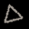
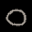
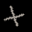

# Geometric primitives classification

The `geometric_primitives.py` script gives a draft implementation of a convolutional neural network to recognize three types of geometric shapes:
* circle
* triangle
* cross

| Triangle | Circle | Cross |
|:-------------------------:|:-------------------------:|:-------------------------:|
|  |  |  |

## Architecture
The CNN consists of two convolutional layers, two pool layers, and two fully connected dense layers. The convolutional layers contain 10 filters. The pool layer is of Max Pool 2x2 type. The CNN has 3 outputs p1,p2,p3 which are the probabilities a sample belongs to the given class.

## Learning algorithm
The CNN solves the problem of classification. In such problems the *Binary Cross Entropy* lost function is widely used.

